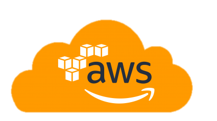

 
 <h1 align="left">Carlos Eduardo Lima</h1>
  

  

 
 

## Hello, Everyone!!

About me

Helping the private pension market to build fully managed environments they can work with/in. Making the best use of computational resources either on-premise or in public clouds.

Work experience with projects, Infrastructure evolve and Cloud Solutions:
- Work experience management VMware Environments with high availability;
- Work experience implementing Network Virtualization ( NSX for vSphere and NSX-T ); 
- Work experience in Firewall CheckPoint;
- Work experience in automation with Ansible, Ansible Tower (Red Hat® Ansible® Automation Platform) and Shell Scripts;
- Work experience planning containerized applications to move to the cloud (AWS);
-Bachelor in Information os Systems with an MBA in DevOps Engineering Integration Architecture

❤ Evangelista de IaC com `Terraform` ❤

  

### 🖥️ Tecnologias e Ferramentas: 
<code></code>
<code></code>
<code></code>
<code></code>
<code></code>
<code></code>
<code></code>

 

<!---
kduchagaslima/kduchagaslima is a ✨ special ✨ repository because its `README.md` (this file) appears on your GitHub profile.
You can click the Preview link to take a look at your changes.
--->
